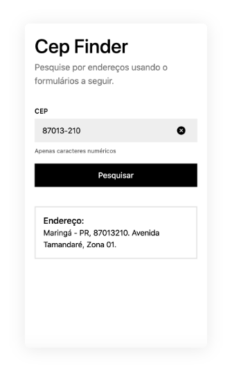

# Cep Finder
Cep Finder é uma ferramenta de busca de endereços brasileiros a partir do CEP.

## Tecnologias
Para a criação desse projeto, foram utilizadas as seguintes tecnologias:
- NodeJS;
- Docker;
- MongoDB;
- ReactJS;
- BaseWeb.

# Snapshot
Visualize um snapshot do projeto:


## Como executar o projeto
Instruções de instalação e execução do projeto.

### Requisitos
Será necessário que você tenha instalado em sua máquina as seguintes ferramentas:

- NodeJS;
- NPM;
- Docker (Opcional);
- MongoDB.

Com o ambiente devidamente configurado, siga os passos a seguir para executar a aplicação `back-end` e `front-end`.

#### Back-end
Navegue para o diretório do backend, `/api`:
```
cd api
```

Instale as dependências necessárias para executar o projeto:
```
npm install
```

(Opcional) Caso não tenha o banco de dados MongoDB instalado e possua familiaridade com o Docker, você pode criar um container MongoDB a partir do docker-compose com o comando a seguir:
```
docker-compose up -d
```

(Opcional) Caso seja necessário, altere as configurações do banco de dados no arquivo `.env`.

Execute o projeto com o comando:
```
npm run start
```
**OBS:** é necessário que o banco de dados MongoDB esteja executando nesse momento.

(Opcional, apenas para modo de desenvolvimento) Execute o projeto em modo de desenvolvimento a partir do comando:
```
npm run dev
```

##### Tests
Para executar os testes de unidade do projeto, execute o comando:
```
npm run test
```

#### Front-end
Para executar o front-end, em uma nova aba do terminal, navegue para o diretório `/app`:
```
cd app
```

Instale as dependências necessárias para executar o projeto:
```
npm install
```

Execute o projeto a partir do comando:
```
npm run start
```

Pronto! Nesse momento, provavelmente você já estará conseguindo utilizar o projeto.

O `front-end` estará disponível no seguinte endpoint: http://localhost:3000.

### Dúvidas ou Problemas
Caso encontre dificuldades para executar o projeto, por favor, entre em contato comigo por e-mail: carloseduardo.diasgiacomini@gmail.com.
